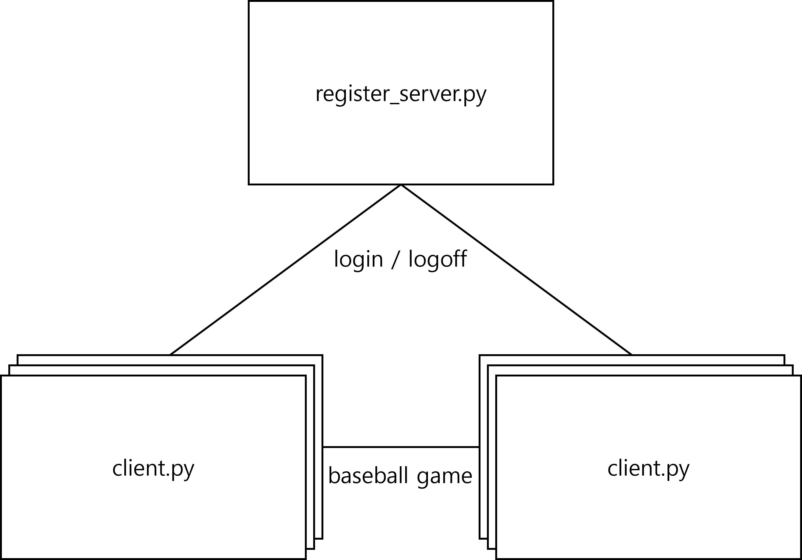

# P2P baseball game

This repo provides the source code for assignments for 4471023: Data Communication.

    

## Dependencies
* Python 3.10.6

## Overview
* client.py
    - handle all the core features
* register_server.py
    - maintains list of online users

## How to use
- Initializes the register_server.py
- Run arbitrary number of client.py
- Client can fetch list of online users and challenge the baseball game to any online peers
- User who initiated the game, guesses the number and user who got challenged automatically evalutes the guessing number and returns corresponding values of form (# of strikes, # of balls)